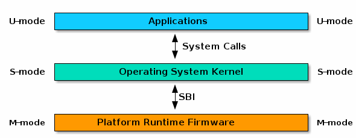

# Lab 1: RV64 内核引导与时钟中断处理

## 实验目的
* 学习 RISC-V 汇编，编写 head.S 实现跳转到内核运行的第一个 C 函数；
* 学习 OpenSBI，理解 OpenSBI 在实验中所起到的作用，并调用 OpenSBI 提供的接口完成字符的输出；
* 学习 Makefile 相关知识，补充项目中的 Makefile 文件，来完成对整个工程的管理；
* 学习 RISC-V 的 trap 处理相关寄存器与指令，完成对 trap 处理的初始化；
* 理解 CPU 上下文切换机制，并正确实现上下文切换功能；
* 编写 trap 处理函数，完成对特定 trap 的处理；
* 调用 OpenSBI 提供的接口，完成对时钟中断事件的设置。

## 实验环境

- Environment in Lab0

!!! warning "Ubuntu 22.04 可能遇到兼容性问题"
    由于 Ubuntu 22.04 apt 中的 qemu 只有 6.2 版本，而这个版本下的 OpenSBI 也很老，而且在后续页表等实验中也会有严重的潜在 bug，所以请同学们通过 `qemu-system-riscv64 --version` 自查 qemu 版本，保证其在 8.2.2 及以上（Ubuntu 24.04 apt 中 qemu 为 8.2.2）。如果版本过低，请参考 [QEMU Wiki](https://wiki.qemu.org/Hosts/Linux) 自行编译新版 qemu：

    ```bash
    git clone https://github.com/qemu/qemu.git
    cd qemu
    sudo apt-get install git libglib2.0-dev libfdt-dev libpixman-1-dev zlib1g-dev ninja-build
    ./configure --target-list=riscv64-softmmu
    make -j$(nproc)
    ```

!!! tip "升级到 Ubuntu 24.04"

    已经安装 Ubuntu 22.04 或更旧版本的同学可以选择参考[常见问题及解答 - 如何升级到 Ubuntu 24.04](faq.md#ubuntu-2404) 进行升级。

    升级后，APT 会自动将 QEMU 等软件包升级到软件仓库中较新的版本。

## 实验基础知识介绍

### RV64 内核引导

#### RISC-V 手册

为了顺利完成 OS 实验，我们需要很多 RISC-V 指令集的基础知识，这些课堂上大部分不会讲授，请同学们通过阅读以下几份手册文档进行自学：

- [RISC-V Assembly Programmer's Manual](https://github.com/riscv-non-isa/riscv-asm-manual/blob/main/src/asm-manual.adoc)
- [RISC-V Unprivileged Spec](https://github.com/riscv/riscv-isa-manual/releases/download/20240411/unpriv-isa-asciidoc.pdf)
- [RISC-V Privileged Spec](https://github.com/riscv/riscv-isa-manual/releases/download/20240411/priv-isa-asciidoc.pdf)
- [RISC-V Supervisor Binary Interface Specification](https://github.com/riscv-non-isa/riscv-sbi-doc/releases/download/v2.0/riscv-sbi.pdf)（SBI）

!!! tip "指令速查以及快速学习可以参考 https://note.tonycrane.cc/cs/pl/riscv/"

!!! warning "一切均以 spec 为准，不可跳过阅读 spec 这一步骤；中文版 RISC-V 手册质量良莠不齐，请谨慎参考并以英文版内容为准。"

!!! note "关于手册版本"
    RISC-V ISA 的手册已经更新到当前最新的 ratified 版本，即 20240411 版本。过去的老版本为 20191213 的非特权级 ISA 和 20211203 的特权级 ISA，相比之下当前的文档样式和内容上都有所改变，一切以最新 ratified spec 为准。

    除去 RISC-V ISA 的手册外，其他 RISC-V 的技术规范也可以在 [RISC-V Wiki - RISC-V Tecnical Specifications](https://wiki.riscv.org/display/HOME/RISC-V+Technical+Specifications) 中找到，感兴趣的同学可以自行查阅。

#### RISC-V 的三种特权模式

RISC-V 有三个特权模式：U（user）模式、S（supervisor）模式和 M（machine）模式。

| Level  | Encoding |       Name       | Abbreviation |
| ------ | -------- |----------------- | ------------ |
|   0    |    00    | User/Application |      U       |
|   1    |    01    |     Supervisor   |      S       |
|   2    |    10    |                  |              |
|   3    |    11    |      Machine     |      M       |

其中：

- M 模式是对硬件操作的抽象，有**最高**级别的权限；
- S 模式介于 M 模式和 U 模式之间，在操作系统中对应于内核态（kernel）。当用户需要内核资源时，向内核申请，并切换到内核态进行处理；
- U 模式用于执行用户程序，在操作系统中对应于用户态，有**最低**级别的权限。

#### 从计算机上电到 OS 运行

我们以最基础的嵌入式系统为例，计算机上电后，首先硬件进行一些基础的初始化后，将 CPU 的 Program Counter 移动到内存中 bootloader 的起始地址。

Bootloader 是操作系统内核运行之前，用于初始化硬件，加载操作系统内核。

在 RISC-V 架构里，bootloader 运行在 M 模式下。Bootloader 运行完毕后就会把当前模式切换到 S 模式下，机器随后开始运行 kernel。

这个过程简单而言就是这样：

```
   Hardware             RISC-V M Mode           RISC-V S Mode 
+------------+         +--------------+         +----------+
|  Power On  |  ---->  |  Bootloader  |  ---->  |  Kernel  |
+------------+         +--------------+         +----------+
```

#### SBI 与 OpenSBI

SBI（Supervisor Binary Interface）是 S-mode 的 Kernel 和 M-mode 执行环境之间的接口规范，而 [OpenSBI](https://github.com/riscv-software-src/opensbi) 是一个 [RISC-V SBI 规范](https://github.com/riscv-non-isa/riscv-sbi-doc/releases/download/v2.0/riscv-sbi.pdf)的开源实现。RISC-V 平台和 SoC 供应商可以自主扩展 OpenSBI 实现，以适应特定的硬件配置。

简单的说，为了使操作系统内核适配不同硬件，OpenSBI 提出了一系列规范对 M-mode 下的硬件进行了统一定义，运行在 S-mode 下的内核可以按照这些规范对不同硬件进行操作。



为降低实验难度，我们选择 OpenSBI 作为 bootloader 来完成机器启动时 M-mode 下的硬件初始化与寄存器设置，并使用 OpenSBI 所提供的接口完成诸如字符打印的操作。

在实验中，QEMU 已经内置了 OpenSBI 作为 bootloader，我们可以使用 `-bios default` 启用。如果启用，QEMU 会将 OpenSBI 代码加载到 `0x80000000` 起始处。OpenSBI 初始化完成后，会跳转到 `0x80200000` 处（也就是 kernel 的起始地址）。因此，我们所编译的代码需要放到 `0x80200000` 处。

!!! note "如果你对 RISC-V 架构的 boot 流程有更多的好奇，可以参考这份 [bootflow](https://riscv.org/wp-content/uploads/2019/12/Summit_bootflow.pdf)"

#### GNU Make

GNU Make 是一个用于自动化编译的工具，它通过读取 Makefile 文件中的规则来执行编译过程。Makefile 文件中包含了一系列的规则，描述了源文件之间的依赖关系，以及如何编译和链接这些源文件。在阅读了 [Makefile 介绍](https://seisman.github.io/how-to-write-makefile/introduction.html)这一章节后，同学们可以根据工程文件夹里 Makefile 的代码来掌握一些基本的使用技巧。

#### 内联汇编
内联汇编（通常由 `#!c asm` 或者 `#!c __asm__` 关键字引入）提供了将汇编语言源代码嵌入 C 程序的能力。

内联汇编的详细介绍请参考 [Assembler Instructions with C Expression Operands](https://gcc.gnu.org/onlinedocs/gcc/Extended-Asm.html) 。

下面简要介绍一下这次实验会用到的一些内联汇编知识，内联汇编基本格式为：

```c
    __asm__ volatile (
        "instruction1\n"
        "instruction2\n"
        ......
        ......
        "instruction3\n"
        : [out1] "=r" (v1),[out2] "=r" (v2)
        : [in1] "r" (v1), [in2] "r" (v2)
        : "memory"
    );
```

其中，三个 `:` 将汇编部分分成了四部分：

- 第一部分是汇编指令，指令末尾需要添加 `\n`；
- 第二部分是输出操作数部分；
- 第三部分是输入操作数部分；
- 第四部分是可能影响的寄存器或存储器，用于告知编译器当前内联汇编语句可能会对某些寄存器或内存进行修改，使得编译器在优化时将其因素考虑进去。

这四部分中后三部分不是必须的。

??? example "示例一"

    ```c
    unsigned long long s_example(unsigned long long type, unsigned long long arg0) {
        unsigned long long ret_val;
        asm volatile (
            "mv x10, %[type]\n"
            "mv x11, %[arg0]\n"
            "mv %[ret_val], x12"
            : [ret_val] "=r" (ret_val)
            : [type] "r" (type), [arg0] "r" (arg0)
            : "memory"
        );
        return ret_val;
    }
    ```
    示例一中指令部分，`%[type]`、`%[arg0]` 以及 `%[ret_val]` 代表着特定的寄存器或是内存。

    输入输出部分中，`[type] "r" (type)`代表着将 `()` 中的变量 `type` 放入寄存器中（`"r"` 指放入寄存器，如果是 `"m"` 则为放入内存），并且绑定到 `[]` 中命名的符号中去。`[ret_val] "=r" (ret_val)` 代表着将汇编指令中 `%[ret_val]` 的值更新到变量 `ret_val`中。

??? example "示例二"

    ```c
    #define write_csr(reg, val) ({ asm volatile ("csrw " #reg ", %0" :: "r"(val)); })
    ```

    示例二定义了一个宏，其中 `%0` 代表着输出输入部分的第一个符号，即 `val`。

    `#reg` 是c语言的一个特殊宏定义语法，相当于将reg进行宏替换并用双引号包裹起来。

    例如 `write_csr(sstatus,val)` 经宏展开会得到：

    ```c
    ({ asm volatile ("csrw " "sstatus" ", %0" :: "r"(val)); })
    ```

    此外，这个示例中的 `({...})` 还涉及了一个 GNU 对 C 的扩展，用于将一段代码块作为一个表达式来使用，可以参考 [Statements and Declarations in Expressions](https://gcc.gnu.org/onlinedocs/gcc/Statement-Exprs.html)。比如以下代码：

    ```c 
    #define max(a, b)            \
    ({                         \
        __typeof__(a) __a = (a); \
        __typeof__(b) __b = (b); \
        __a > __b ? __a : __b;   \
    })

    int c = max(x++, y++);
    ```

    在宏展开之后就变成了：

    ```c 
    int c = ({
    __typeof__(x++) __a = (x++);
    __typeof__(y++) __b = (y++);
    __a > __b ? __a : __b;
    });
    ```

    这样的写法可以避免宏展开后的副作用，在上面的例子中 `x++` 和 `y++` 只会被执行一次，同学们可以自行比较其与 `#!c #define max(a, b) ((a) > (b) ? (a) : (b))` 的区别。

#### 编译相关知识介绍
##### vmlinux.lds

GNU ld 即链接器，用于将 `*.o` 文件（和库文件）链接成可执行文件。在操作系统开发中，为了指定程序的内存布局，ld 使用链接脚本（Linker Script）来控制，在 Linux kernel 中链接脚本被命名为 vmlinux.lds。更多关于 ld 的介绍可以使用 `man ld` 命令。

下面给出一个 `vmlinux.lds` 的例子：

```lds
/* 目标架构 */
OUTPUT_ARCH("riscv")

/* 程序入口 */
ENTRY(_start)

/* kernel 代码起始位置 */
BASE_ADDR = 0x80200000;

SECTIONS {
    /* . 代表当前地址 */
    . = BASE_ADDR;

    /* 记录 kernel 代码的起始地址 */
    _skernel = .;

    /* ALIGN(0x1000) 表示 4KiB 对齐 */
    /* _stext, _etext 分别记录了 text 段的起始与结束地址 */
    .text : ALIGN(0x1000) {
        _stext = .;

        *(.text.entry)
        *(.text .text.*)
        
        _etext = .;
    }

    .rodata : ALIGN(0x1000) {
        _srodata = .;

        *(.rodata .rodata.*)
        
        _erodata = .;
    }

    .data : ALIGN(0x1000) {
        _sdata = .;

        *(.data .data.*)
        
        _edata = .;
    }

    .bss : ALIGN(0x1000) {
        _sbss = .;

        *(.bss.stack)
        sbss = .;
        *(.bss .bss.*)
        
        _ebss = .;
    }

    /* 记录 kernel 代码的结束地址 */
    _ekernel = .;
}
```

- `OUTPUT_ARCH` 指定了架构为 RISC-V；
- `ENTRY` 指定程序入口点为 `_start` 函数，程序入口点即程序启动时运行的函数，经过这样的指定后在 head.S 中需要编写 `_start` 函数，程序才能正常运行；
- 链接脚本中有 `.` `*` 两个重要的符号：
    - 单独的 `.` 在链接脚本代表当前地址，它有赋值、被赋值、自增等操作；
    - `*` 有两种用法，其一是 `*()` 在大括号中表示将所有文件中符合括号内要求的段放置在当前位置，其二是作为通配符；
- 链接脚本的主体是 `SECTIONS` 部分，在这里链接脚本的工作是将程序的各个段按顺序放在各个地址上；
    - 在例子中就是从 `0x80200000` 地址开始放置了 `.text`、`.rodata`、`.data` 和 `.bss` 段，各个段的作用可以简要概括成：

    | 段名      | 主要作用                       |
    | --------- | ----------------------------- |
    | `.text`   | 通常存放程序执行代码              |
    | `.rodata` | 通常存放常量等只读数据            |
    | `.data`   | 通常存放已初始化的全局变量、静态变量 |
    | `.bss`    | 通常存放未初始化的全局变量、静态变量 |

- 在链接脚本中可以自定义符号，例如以上所有 `_s` 与 `_e` 开头的符号都是我们自己定义的。

!!! tip "更多有关链接脚本语法可以参考 [ld script 文档](https://sourceware.org/binutils/docs/ld/Scripts.html)"

##### vmlinux

vmlinux 通常指 Linux kernel 编译出的可执行文件（Executable and Linkable Format，ELF），特点是未压缩的，带调试信息和符号表的。在整套 OS 实验中，vmlinux 通常指将你的代码进行编译，链接后生成的可供 QEMU 运行的 RV64 架构程序。如果对 vmlinux 使用 `file` 命令，你将看到如下信息：

```bash
$ file vmlinux 
vmlinux: ELF 64-bit LSB executable, UCB RISC-V, version 1 (SYSV), statically linked, not stripped
```

##### System.map

System.map 是内核符号表（Kernel Symbol Table）文件，是存储了所有内核符号及其地址的一个列表。“符号”通常指的是函数名，全局变量名等等。使用 `nm vmlinux` 命令即可打印 vmlinux 的符号表，符号表的样例如下：

```
0000000000000800 A __vdso_rt_sigreturn
ffffffe000000000 T __init_begin
ffffffe000000000 T _sinittext
ffffffe000000000 T _start
ffffffe000000040 T _start_kernel
ffffffe000000076 t clear_bss
ffffffe000000080 t clear_bss_done
ffffffe0000000c0 t relocate
ffffffe00000017c t set_reset_devices
ffffffe000000190 t debug_kernel
```

使用 System.map 可以方便地读出函数或变量的地址，为 debug 提供了方便。

### RV64 时钟中断处理

!!! warning
    本 3.1 节涉及到很多 RISC-V 特权级指令的知识，在学习中请同时参考 [RISC-V Privileged Spec](https://github.com/riscv/riscv-isa-manual/releases/download/20240411/priv-isa-asciidoc.pdf) 阅读详细信息，如果本文档和 spec 中有任何出入的地方，请以 spec 为准，并及时向助教反馈。

    关于 RISC-V 特权级 ISA，也可以参考 <https://note.tonycrane.cc/cs/pl/riscv/privileged/>。

如果完成了 **3.1** 中的 **RV64 内核引导**，我们能成功地将一个最简单的 OS 启动起来，但还没有办法与之交互。我们在课程中讲过操作系统启动之后由**事件**（**event**）驱动，在本次实验的后半部分中，我们将引入一种重要的事件 **trap**。

trap 给了 OS 与硬件、软件交互的能力。在 **3.1** 中我们介绍了在 RISC-V 中有三种特权级（M 态、S 态、U 态），在 boot 阶段，OpenSBI 已经帮我们将 M 态的 trap 处理进行了初始化，这一部分不需要我们再去实现，因此后续我们重点关注 S 态的 trap 处理。

#### RISC-V 中的 interrupt 和 exception
##### 什么是 interrupt 和 exception

!!! abstract "[RISC-V Unprivileged Spec](https://github.com/riscv/riscv-isa-manual/releases/download/20240411/unpriv-isa-asciidoc.pdf) 1.6 节中对于 trap、interrupt 与 exception 的描述"
    We use the term *exception* to refer to an unusual condition occurring at run time **associated with an instruction** in the current RISC-V hart. We use the term *interrupt* to refer to an **external asynchronous event** that may cause a RISC-V hart to experience an unexpected transfer of control. We use the term *trap* to refer to **the transfer of control to a trap handler** caused by either an exception or an interrupt.

总结起来 interrupt 与 exception 的主要区别如下表：

|Interrupt|Exception|
|:---|:---|
|Hardware generate|Software generate|
|These are **asynchronous external requests** for service (like keyboard or printer needs service).|These are **synchronous internal requests** for service based upon abnormal events (think of illegal instructions, illegal address, overflow etc).|
|These are **normal events** and shouldn’t interfere with the normal running of a computer.|These are **abnormal events** and often result in the termination of a program|

上文中的 trap 描述的是一种控制转移的过程，这个过程是由 interrupt 或者 exception 引起的。这里为了方便起见，我们在这里约定 trap 为 interrput 与 exception 的总称。

##### 相关寄存器

除了 32 个通用寄存器之外，RISC-V 架构还有大量的**控制状态寄存器**（Control and Status Registers，CSRs），下面将介绍几个和 trap 机制相关的重要寄存器。

Supervisor Mode 下 trap 相关寄存器:

- `sstatus`（Supervisor Status Register）中存在一个 `SIE`（Supervisor Interrupt Enable）比特位，当该比特位设置为 1 时，会**响应**所有的 S 态 trap，否则将会禁用所有 S 态 trap。
- `sie`（Supervisor Interrupt Enable Register），在 RISC-V 中，interrupt 被划分为三类 software interrupt、timer interrupt、external interrupt。在开启了 `sstatus[SIE]` 之后，系统会根据 `sie` 中的相关比特位来决定是否对该 interrupt 进行**处理**。
- `stvec`（Supervisor Trap Vector Base Address Register）即所谓的“中断向量表基址”。`stvec` 有两种模式：
    - Direct 模式，适用于系统中只有一个中断处理程序，其指向中断处理入口函数（本次实验中我们所用的模式）。
    - Vectored 模式，指向中断向量表，适用于系统中有多个中断处理程序（该模式可以参考 [RISC-V 内核源码](https://elixir.bootlin.com/linux/v6.11/source/arch/riscv/kernel/entry.S#L340)）。
- `scause`（Supervisor Cause Register），会记录 trap 发生的原因，还会记录该 trap 是 interrupt 还是 exception。
- `sepc`（Supervisor Exception Program Counter），会记录触发 exception 的那条指令的地址。

Machine Mode 异常相关寄存器:

- 类似于 Supervisor Mode，Machine Mode 也有相对应的寄存器，但由于本实验同学不需要操作这些寄存器，故不在此作介绍。

##### 相关特权指令

- `ecall`（Environment Call）：
    - 当我们在 S 态执行这条指令时，会触发一个 `ecall-from-s-mode-exception`，从而进入 M Mode 下的处理流程（如设置定时器等）
    - 当我们在 U 态执行这条指令时，会触发一个 `ecall-from-u-mode-exception`，从而进入 S Mode 下的处理流程（常用来进行系统调用）；
- `sret` 用于 S 态 trap 返回，通过 `sepc` 来设置 `pc` 的值，返回到之前程序继续运行。

#### 上下文处理

由于在处理 trap 时，有可能会改变系统的状态。所以在真正处理 trap 之前，我们有必要对系统的当前状态进行保存，在处理完成之后，我们再将系统恢复至原先的状态，就可以确保之前的程序继续正常运行。这里的系统状态通常是指寄存器，这些寄存器也叫做 CPU 的上下文（Context）。

#### trap 处理程序

trap 处理程序根据 `scause` 的值，进入不同的处理逻辑，在本次试验中我们需要关心的只有 Superviosr Timer Interrupt。

#### 时钟中断

时钟中断需要 CPU 硬件的支持。CPU 以“时钟周期”为工作的基本时间单位，对逻辑门的时序电路进行同步。而时钟中断实际上就是“每隔若干个时钟周期执行一次的程序”。下面介绍与时钟中断相关的寄存器以及如何产生时钟中断。

- `mtime` 与 `mtimecmp`（Machine Timer Register）：
    - `mtime` 是一个实时计时器，由硬件以恒定的频率自增
    - `mtimecmp` 中保存着下一次时钟中断发生的时间点，当 `mtime` 的值大于或等于 `mtimecmp` 的值，系统就会触发一次时钟中断
    - 因此我们只需要更新 `mtimecmp` 中的值，就可以设置下一次时钟中断的触发点。OpenSBI 已经为我们提供了更新 `mtimecmp` 的接口 `sbi_set_timer`（见 `lab1` 4.2.3 节）。
- `mcounteren`（Counter-Enable Registers）：
    - 由于 `mtime` 是属于 M 态的寄存器，我们在 S 态无法直接对其读写，幸运的是 OpenSBI 在 M 态已经通过设置 `mcounteren` 寄存器的 `TM` 比特位，让我们可以在 S 态中可以通过 `time` 这个**只读**寄存器读取到 `mtime` 的当前值，相关汇编指令是 `rdtime`。

??? note "为什么不要直接读写 `mtimecmp`？"

    同学们在自己尝试或阅读资料（如 [RISC-V Bytes: Timer Interrupts · Daniel Mangum](https://danielmangum.com/posts/risc-v-bytes-timer-interrupts/) 和 [RISC-V Assembly Programmer's Manual#Control and Status Registers](https://github.com/riscv-non-isa/riscv-asm-manual/blob/main/src/asm-manual.adoc#control-and-status-registers)）时可能会直接读写 `mtimecmp` 寄存器来设置时钟中断的方法。然而标准规定 `mtime` 和 `mtimecmp` 是 M 模式下读写的内存映射的寄存器：

    > Platforms provide a real-time counter, exposed as a memory-mapped **machine-mode read-write** register, `mtime`.
    >
    > Platforms provide a 64-bit memory-mapped **machine-mode** timer compare register (`mtimecmp`).
    >
    > From *The RISC-V Instruction Set Manual: Volume II 3.2.1*

    现在我们在 S 模式，是无法读写这两个寄存器的。如果去读写，就会触发 Store/AMO Access Fault 异常。因此**只能**通过 ecall 交给 `sbi_set_timer` 来设置 `mtimecmp` 的值，从而实现时钟中断的设置。

    ??? note "`sbi_set_timer` 是如何工作的？"

        但如果去读 OpenSBI [源码](https://github.com/riscv-software-src/opensbi/blob/c4940a9517486413cd676fc8032bb55f9d4e2778/lib/sbi/sbi_timer.c#L132)，又会发现它也不是直接写 `mtimecmp` 的，而是写入了 `stimecmp`：

        ```c title="opensbi/lib/sbi/sbi_timer.c"
        void sbi_timer_event_start(u64 next_event)
        {
            sbi_pmu_ctr_incr_fw(SBI_PMU_FW_SET_TIMER);

            /**
            * Update the stimecmp directly if available. This allows
            * the older software to leverage sstc extension on newer hardware.
            */
            if (sbi_hart_has_extension(sbi_scratch_thishart_ptr(), SBI_HART_EXT_SSTC)) {
        # if __riscv_xlen == 32
                csr_write(CSR_STIMECMP, next_event & 0xFFFFFFFF);
                csr_write(CSR_STIMECMPH, next_event >> 32);
        # else
                csr_write(CSR_STIMECMP, next_event);
        # endif
            } else if (timer_dev && timer_dev->timer_event_start) {
                timer_dev->timer_event_start(next_event);
                csr_clear(CSR_MIP, MIP_STIP);
            }
            csr_set(CSR_MIE, MIP_MTIP);
        }
        ```

        这是因为 [RISC-V SSTC 扩展](https://tools.cloudbear.ru/docs/riscv-sstc-0.5.4-20211013.pdf)，该扩展的简介也阐明了 RISC-V 各个模式的时钟中断处理机制：

        > The current Privileged arch specification only defines a hardware mechanism for generating machine-mode timer
        > interrupts (based on the mtime and mtimecmp registers). With the resultant requirement that timer services for
        > S-mode/HS-mode (and for VS-mode) have to all be provided by M-mode - via SBI calls from S/HS-mode up to
        > M-mode (or VS-mode calls to HS-mode and then to M-mode).
        > 
        > This extension serves to provide supervisor mode with its own CSR-based timer interrupt facility that it can
        > directly manage to provide its own timer service (in the form of having its own stimecmp register) - thus
        > eliminating the large overheads for emulating S/HS-mode timers and timer interrupt generation up in M-mode.
        > Further, this extension adds a similar facility to the Hypervisor extension for VS-mode.
        >
        > 总结：在当前 RISC-V 特权架构中，S 模式和 HS 模式的定时器服务需要依赖 M 模式提供，这导致了额外的开销。为了解决这个问题，该扩展引入了 S 模式的独立定时器中断机制，允许 S 模式直接管理自己的定时器，降低了对 M 模式的依赖。此外，VS 模式也获得了类似的功能，简化了定时器的管理和中断生成。

        目前，QEMU 的 RISC-V 模拟器已经支持了 SSTC 扩展，因此我们**可以直接通过 `stimecmp` 来设置时钟中断。但为了兼容性考虑**，仍应当使用 `sbi_set_timer` 来设置时钟中断，这样在 SSTC 扩展不被支持的情况下，将 fallback 到 M 模式下的时钟中断处理机制。

## 实验步骤

### 准备工程

从 [repo](https://github.com/ZJU-SEC/os24fall-stu) 同步实验代码框架。为了减少大家的工作量，在这里我们提供了系统二助教 [45gfg9](https://github.com/45gfg9) 编写的 `printk` 来输出格式化字符串。

!!! note "printk 和之前大家用过的 printf 用法一致，遇到什么输出上的 bug 请及时联系助教"

```
├── arch
│   └── riscv
│       ├── include
│       │   ├── defs.h
│       │   └── sbi.h
│       ├── kernel
│       │   ├── head.S
│       │   ├── Makefile
│       │   ├── sbi.c
│       │   └── vmlinux.lds
│       └── Makefile
├── include
│   ├── printk.h
│   ├── stddef.h
│   └── stdint.h
├── init
│   ├── main.c
│   ├── Makefile
│   └── test.c
├── lib
│   ├── Makefile
│   └── printk.c
└── Makefile
```

完成 **RV64 内核引导**，需要完善以下文件，删除 Unimplemented 的提示并完成代码：

- `lib/Makefile`
- `arch/riscv/kernel/head.S`
- `arch/riscv/kernel/sbi.c`
- `arch/riscv/include/defs.h`

完成 **RV64 时钟中断处理**，需要完善 / 添加以下文件：

- `arch/riscv/kernel/head.S`
- `arch/riscv/kernel/entry.S`
- `arch/riscv/kernel/trap.c`
- `arch/riscv/kernel/clock.c`
- `arch/riscv/include/clock.h`
- `arch/riscv/kernel/sbi.c`

### RV64 内核引导

#### 完善 Makefile 脚本

阅读文档中关于 [GNU Make](#gnu-make) 的章节，以及工程文件中的 Makefile 文件，根据注释学会 Makefile 的使用规则后，补充 `lib/Makefile`，使工程得以编译。

!!! tip "可参考其他文件夹的 Makefile"

完成此步后在工程根文件夹执行 make，可以看到不会再提示 Makefile 的错误，而是 C 或汇编代码中的 `#!c #error` 错误。

#### 编写 head.S

学习 RISC-V 汇编，并完成 `arch/riscv/kernel/head.S`。

我们首先为即将运行的第一个 C 函数设置程序栈（栈的大小可以设置为 4KiB），并将该栈放置在 `.bss.stack` 段。接下来我们只需要通过跳转指令，跳转至 main.c 中的 `start_kernel` 函数即可。

#### 补充 sbi.c

OpenSBI 在 M 态，为 S 态提供了多种接口，比如字符串输入输出。因此我们需要实现调用 OpenSBI 接口的功能。给出函数定义如下：

```c
struct sbiret {
    uint64_t error;
    uint64_t value;
};

struct sbiret sbi_ecall(uint64_t eid, uint64_t fid,
                        uint64_t arg0, uint64_t arg1, uint64_t arg2,
                        uint64_t arg3, uint64_t arg4, uint64_t arg5);
```

`sbi_ecall` 函数中，需要完成以下内容：

1. 将 `eid`（Extension ID）放入寄存器 `a7` 中，`fid`（Function ID）放入寄存器 `a6` 中，将 `arg[0-5]` 放入寄存器 `a[0-5]` 中。
2. 使用 `ecall` 指令。`ecall` 之后系统会进入 M 模式，之后 OpenSBI 会完成相关操作。
3. OpenSBI 的返回结果会存放在寄存器 `a0`，`a1` 中，其中 `a0` 为 error code，`a1` 为返回值，我们用 `sbiret` 来接受这两个返回值。

同学们可以参照内联汇编的示例一完成该函数的编写。

???+ example
    编写成功后，调用 `sbi_ecall(0x4442434E, 0x2, 0x30, 0, 0, 0, 0, 0)` 将会输出字符 `'0'`，其中：

    - `0x4442434E` 代表 Debug Console Extension 的 Extension ID（`DBCN`）
    - `0x2` 代表 Console Write Byte 的 FunctionID
    - `0x30` 代表 '0' 的 ascii 值
    - 其余参数填 0

请在 `arch/riscv/kernel/sbi.c` 中补充 `sbi_ecall()`。

下面列出了一些在后续的实验中可能需要使用的功能，也可以在 `sbi.c` 及 `sbi.h` 中一并实现：

| Function Name | Description | Extension ID | Function ID |
|---|---|---|---|
|`sbi_set_timer`|设置时钟相关寄存器|0x54494d45|0| 
|`sbi_debug_console_write`|向终端写入数据|0x4442434e|0|
|`sbi_debug_console_read`|从终端读取数据|0x4442434e|1|
|`sbi_debug_console_write_byte`|向终端写入单个字符|0x4442434e|2|
|`sbi_system_reset`|重置系统（关机或重启）|0x53525354|0|

关于 OpenSBI 的更多接口，请参考 [RISC-V SBI v2.0 Specification](https://github.com/riscv-non-isa/riscv-sbi-doc/releases/download/v2.0/riscv-sbi.pdf)。

`printk` 会调用 `putc` 来输出单个字符，而其中调用了 `sbi_debug_console_write_byte`，所以为了使用 `printk` 请在 `sbi.c` 中正确利用 `sbi_ecall` 实现这个函数。

`test.c` 中在 kernel 运行的结尾会调用 `sbi_system_reset(0, 0)` 来 shutdown，所以你也需要在 `sbi.c` 中正确实现 `sbi_system_reset`。

??? note "关于 SBI 版本问题"
    曾经的实验文档中使用 `sbi_ecall(0x1, 0x0, 0x30, 0, 0, 0, 0, 0)` 达到了和 `sbi_ecall(0x4442434E, 0x2, 0x30, 0, 0, 0, 0, 0)` 一样的效果，并且 `sbi_set_timer` 等函数的 EID 都很小（0x00 - 0x0F），这些实际上都是 v0.1 的旧版 SBI 规范，目前称为 Legacy Extensions，已经弃用很久了。具体可见 [RISC-V Supervisor Binary Interface Specification](https://github.com/riscv-non-isa/riscv-sbi-doc/releases/download/v2.0/riscv-sbi.pdf) 的 Chapter 5。因此推荐大家均按照本文档要求使用新版 SBI 规范。

!!! warning "`sbi_ecall` 正确执行但仍没有输出的问题处理"
    如果你的 `sbi_ecall` 函数正确执行了，但是没有任何效果，可能是使用的 OpenSBI 版本过低。如果你还在使用从 Ubuntu 22.04 apt 直接安装的 qemu 的话很可能是这个问题。OpenSBI v1.3 及以上才开始支持这些 SBI 调用，所以你可以在 `make run` 后观察 OpenSBI banner 前的版本号来自查，如果小于 v1.3 的话，那么你就需要更新 qemu 或者 opensbi 了。

    最好的解决办法是根据本页[实验环境](#_2)部分手动编译最新版 qemu，新版 qemu 的 default bios 就是较新版本的 OpenSBI（目前是 v1.5.1），而且更新 qemu 也会消除掉后续实验中的很多潜在 bug。

    如果你实在不想更新 qemu，也可以尝试更新 OpenSBI，即不使用 `-bios default`，我们提供了一个 v1.5 的 OpenSBI 在 `src/lab1/fw_jump.bin`，你可以通过将 `-bios default` 替换为 `-bios fw_jump.bin` 来使用它。你也可以通过 [OpenSBI README](https://github.com/riscv-software-src/opensbi) 的指导来自行编译出这个 `fw_jump.bin`。

#### 修改 defs

学习了解了内联汇编的相关知识后，补充 `arch/riscv/include/defs.h` 中的代码，完成 `read_csr` 的宏定义。

完成以上内容后再次执行 `make`，可以看到在根目录下成功生成了 `vmlinux`。

运行 `make run` 即可执行，检测你的程序是否正确地打印出了欢迎信息 `2024 ZJU Operating System` 并正常退出。

### RV64 时钟中断处理

* 准备工作，先修改 `vmlinux.lds` 以及 `head.S`
    ```diff title="(diff) arch/riscv/kernel/vmlinux.lds" linenums="20"
          .text : ALIGN(0x1000) {
              _stext = .;
    
    +         *(.text.init)         <- 添加 .text.init 段
              *(.text.entry)        <- 后续中断处理程序在 .text.entry 段
              *(.text .text.*)
    ```

    ```diff title="(diff) arch/riscv/kernel/head.S" linenums="1"
          .extern start_kernel
    !     .section .text.init       <- .text.entry 改为 .text.init
          .globl _start
      _start:
    ```

#### 开启 trap 处理
在运行 `start_kernel` 之前，我们要对上面提到的 CSR 进行初始化，初始化包括以下几个步骤：

1. 设置 `stvec`
    - 将 `_traps`（`_traps` 在 4.3.2 中实现）所表示的地址写入 `stvec`
    - 这里我们采用 Direct 模式，而 `_traps` 则是 trap 处理入口函数的基地址。
    !!! tip "可以使用 `la` 指令以及刚才写过的 CSR 读写指令"
2. 开启时钟中断，将 `sie[STIE]` 置 1
3. 设置第一次时钟中断，参考 `clock_set_next_event()`（`clock_set_next_event()` 在 4.3.4 中介绍）中的逻辑用汇编实现
    
    !!! tip "可通过 `rdtime` 指令获取时间，`sbi_set_timer` 设置下一次时钟中断"

4. 开启 S 态下的中断响应，将 `sstatus[SIE]` 置 1

按照下方模版修改 `arch/riscv/kernel/head.S`，并补全 `_start` 中的逻辑:

```asm title="arch/riscv/kernel/head.S"
    .extern start_kernel
    .section .text.init
    .globl _start
_start:
    # (previous) initialize stack

    # set stvec = _traps
    # set sie[STIE] = 1
    # set first time interrupt
    # set sstatus[SIE] = 1

    # (previous) jump to start_kernel
    ...
```

!!! tip "Debug 提示"
    可以先不实现 `stvec` 和 first time interrupt，先关注 `sie` 和 `sstatus` 是否设置正确。

    如果在这部分过程中调用了额外的函数，例如 `sbi_set_timer`，则你需要保证在这之前已经设置好了 `sp`，否则涉及到函数调用则会直接出现异常。

#### 实现上下文切换

我们要使用汇编实现上下文切换机制，包含以下几个步骤：

1. 在 `arch/riscv/kernel/` 目录下添加 `entry.S` 文件
2. 保存 CPU 的寄存器（上下文）到内存中（栈上）
3. 将 `scause` 和 `sepc` 中的值传入 trap 处理函数 `trap_handler`（`trap_handler` 在 4.3.3 中介绍），我们将会在 `trap_handler` 中实现对 trap 的处理
4. 在完成对 trap 的处理之后，我们从内存中（栈上）恢复 CPU 的寄存器（上下文）
5. 从 trap 中返回

按照下方模版修改 `arch/riscv/kernel/entry.S`，并补全 `_traps` 中的逻辑：

```asm title="arch/riscv/kernel/entry.S"
    .extern trap_handler
    .section .text.entry
    .align 2
    .globl _traps 
_traps:
    #error Unimplemented
    
    # 1. save 32 registers and sepc to stack
    # 2. call trap_handler
    # 3. restore sepc and 32 registers (x2(sp) should be restore last) from stack
    # 4. return from trap
```

!!! tip "Debug 提示"
    可以先不实现 call trap_handler，先实现上下文切换逻辑。通过 gdb 跟踪各个寄存器，确保上下文的 save 与 restore 正确实现并正确返回。

#### 实现 trap 处理函数

1. 在 `arch/riscv/kernel/` 目录下添加 `trap.c` 文件
2. 在 `trap.c` 中实现 trap 处理函数 `trap_handler()`，其接收的两个参数分别是 `scause` 和 `sepc` 两个寄存器中的值。

```c title="arch/riscv/kernel/trap.c"
#include "stdint.h"

void trap_handler(uint64_t scause, uint64_t sepc) {
    // 通过 `scause` 判断 trap 类型
    // 如果是 interrupt 判断是否是 timer interrupt
    // 如果是 timer interrupt 则打印输出相关信息，并通过 `clock_set_next_event()` 设置下一次时钟中断
    // `clock_set_next_event()` 见 4.3.4 节
    // 其他 interrupt / exception 可以直接忽略，推荐打印出来供以后调试
    
    #error Unimplemented
}
```

#### 实现时钟中断相关函数

1. 在 `arch/riscv/kernel/` 目录下添加 `clock.c` 文件
2. 在 `clock.c` 中实现 `get_cycles()`
    - 使用 `rdtime` 汇编指令获得当前 `time` 寄存器中的值
3. 在 `clock.c` 中实现 `clock_set_next_event()`
    - 调用 `sbi_set_timer`，设置下一个时钟中断事件

```c title="arch/riscv/kernel/clock.c"
#include "stdint.h"

// QEMU 中时钟的频率是 10MHz，也就是 1 秒钟相当于 10000000 个时钟周期
uint64_t TIMECLOCK = 10000000;

uint64_t get_cycles() {
    // 编写内联汇编，使用 rdtime 获取 time 寄存器中（也就是 mtime 寄存器）的值并返回
    #error Unimplemented
}

void clock_set_next_event() {
    // 下一次时钟中断的时间点
    uint64_t next = get_cycles() + TIMECLOCK;

    // 使用 sbi_set_timer 来完成对下一次时钟中断的设置
    #error Unimplemented
} 
```

#### 修改 test 函数

为了让 kernel 持续运行，并使中断更容易观察，将 `test.c` 中的 `test()` 函数修改为如下内容：

```c title="init/test.c"
#include "printk.h"

void test() {
    int i = 0;
    while (1) {
        if ((++i) % 100000000 == 0) {
            printk("kernel is running!\n");
            i = 0;
        }
    }
}
```

#### 编译及测试

由于加入了一些新的 `.c` 文件，可能需要修改一些 Makefile 文件，请同学自己尝试修改，使项目可以编译并运行。

下面是一个正确实现的输出样例。（仅供参考，实际情况可能略有不同，时钟中断输出位置不一样无所谓，也可以适当调整上面 `test()` 函数中的输出条件）：

```
2024 ZJU Operating System
[S] Supervisor Mode Timer Interrupt
kernel is running!
[S] Supervisor Mode Timer Interrupt
kernel is running!
[S] Supervisor Mode Timer Interrupt
kernel is running!
[S] Supervisor Mode Timer Interrupt
kernel is running!
[S] Supervisor Mode Timer Interrupt
kernel is running!
[S] Supervisor Mode Timer Interrupt
kernel is running!
[S] Supervisor Mode Timer Interrupt
kernel is running!
[S] Supervisor Mode Timer Interrupt
kernel is running!
[S] Supervisor Mode Timer Interrupt
kernel is running!
[S] Supervisor Mode Timer Interrupt
```

## 其他架构的交叉编译——以 Aarch64 为例

### 交叉编译工具链的安装

那么如何安装不同架构的交叉编译工具链呢？最简单的方法是用 Ubuntu 自带的软件包管理器 `apt`，先找到有什么交叉编译工具可以装：

```bash
# 搜索包含 aarch64 的软件包，一般是交叉编译工具
apt-cache search aarch64
...
# 搜索结果中如果有 gcc-xxx-linux-gnu，一般需求下装它就行了（具体情况具体分析哈）
sudo apt install gcc-aarch64-linux-gnu
```

现在我们有 aarch64 的交叉编译工具链了，开始编译吧！

### 怎么获得编译过程的中间产物

!!! note "注意这里说的“编译过程”包括预处理、编译、汇编、链接"

对于 Linux kernel，编译命令和选项在不同架构之间都大同小异，一般遵循以下形式（类比 lab0 做过的 riscv64 即可）

```bash
make ARCH=xxx CROSS_COMPILE=some-certain-arch- <options> <files>
```

比如，想获得 kernel 中 `xxx.c` 的预处理产物（回忆一下预处理做了什么）`xxx.i`，我们可以：

```bash
# 先 config（根据实际需求，这里不一定是 defconfig，可选的 config 可以在 `arch/<ARCH>/configs` 下找到）
make ARCH=arm64 CROSS_COMPILE=aarch64-linux-gnu- defconfig

# 然后指定要生成的文件
make ARCH=arm64 CROSS_COMPILE=aarch64-linux-gnu- <path/to/file(no suffix)>.i
```

课件里也给出了 `make` 工具。

## 思考题

1. 请总结一下 RISC-V 的 calling convention，并解释 Caller / Callee Saved Register 有什么区别？
2. 编译之后，通过 System.map 查看 vmlinux.lds 中自定义符号的值并截图。
3. 用 `csr_read` 宏读取 `sstatus` 寄存器的值，对照 RISC-V 手册解释其含义并截图。
4. 用 `csr_write` 宏向 `sscratch` 寄存器写入数据，并验证是否写入成功并截图。
5. 详细描述你可以通过什么步骤来得到 `arch/arm64/kernel/sys.i`，给出过程以及截图。
6. 寻找 Linux v6.0 中 ARM32 RV32 RV64 x86_64 架构的系统调用表；
    - 请列出源代码文件，展示完整的系统调用表（宏展开后），每一步都需要截图。
7. 阐述什么是 ELF 文件？尝试使用 readelf 和 objdump 来查看 ELF 文件，并给出解释和截图。
    - 运行一个 ELF 文件，然后通过 `cat /proc/PID/maps` 来给出其内存布局并截图。
8. 在我们使用 make run 时，OpenSBI 会产生如下输出：
    ```plaintext
        OpenSBI v1.5.1
         ____                    _____ ____ _____
        / __ \                  / ____|  _ \_   _|
       | |  | |_ __   ___ _ __ | (___ | |_) || |
       | |  | | '_ \ / _ \ '_ \ \___ \|  _ < | |
       | |__| | |_) |  __/ | | |____) | |_) || |_
        \____/| .__/ \___|_| |_|_____/|____/_____|
              | |
              |_|

        ......

        Boot HART MIDELEG         : 0x0000000000000222
        Boot HART MEDELEG         : 0x000000000000b109

        ......
    ```
    - 通过查看 [RISC-V Privileged Spec](https://github.com/riscv/riscv-isa-manual/releases/download/20240411/priv-isa-asciidoc.pdf) 中的 `medeleg` 和 `mideleg` 部分，解释上面 `MIDELEG` 和 `MEDELEG` 值的含义。

## 实验任务与要求

- 请各位同学独立完成作业，任何抄袭行为都将使本次作业判为 0 分。
- 在学在浙大中提交：
    - 整个工程代码的压缩包（提交之前请使用 `make clean` 清除所有构建产物）
    - pdf 格式的实验报告：
        - 记录实验过程并截图（4.1-4.3），并对每一步的命令以及结果进行必要的解释；
        - 记录遇到的问题和心得体会；
        - 完成思考题。

!!! tip "关于实验报告内容要求，可见：[常见问题及解答 - 实验提交要求](faq.md#_2)"
